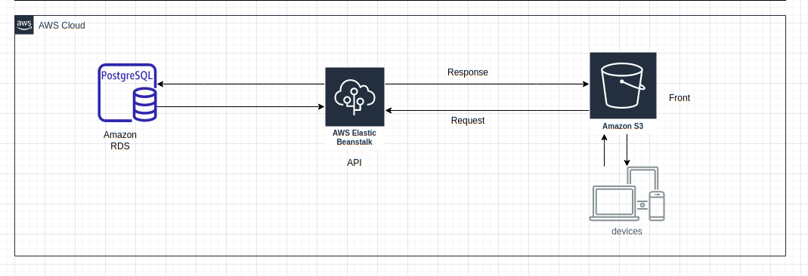
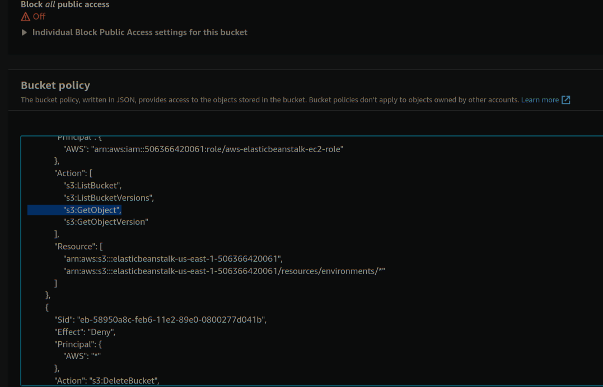

# Hosting a Full-Stack Application

Required for udaicty full stack nanodegree.

Front Link: http://elasticbeanstalk-us-east-1-506366420061.s3.amazonaws.com/index.html

Includes docs on [dependinces](https://github.com/MinaSameh1/deployment-process-project-starter/blob/master/docs/dependencies.md) used and [Infstructure](https://github.com/MinaSameh1/deployment-process-project-starter/blob/master/docs/Infrastructure.md)

## Screenshots and diagram

### Infrastructure

#### Pipeline

#### App on AWS

### Services and app working.

#### S3 Bucket Public

#### DB working

#### CircleCI

#### CircleCI ENV vars

#### elasticbean working

#### Frontend working

#### API working

