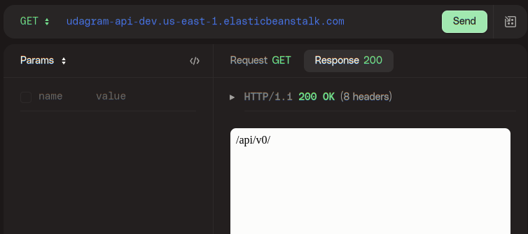

# Hosting a Full-Stack Application

Required for udaicty full stack nanodegree.

[Front link](https://elasticbeanstalk-us-east-1-506366420061.s3.amazonaws.com/index.html): https://elasticbeanstalk-us-east-1-506366420061.s3.amazonaws.com/index.html

## Screens

#### DB working

#### CircleCI

#### CircleCI ENV vars

#### elasticbean working

#### Frontend working

#### API working

