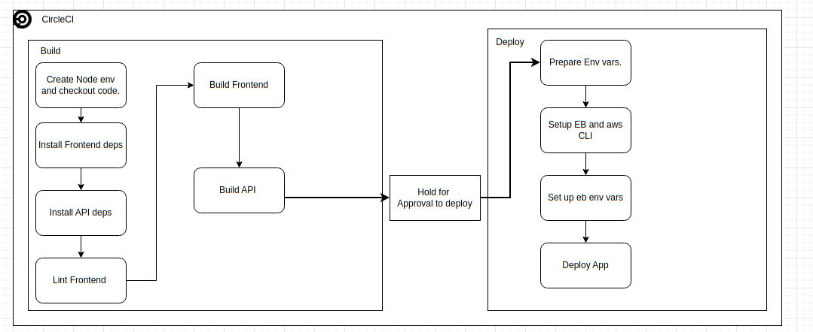
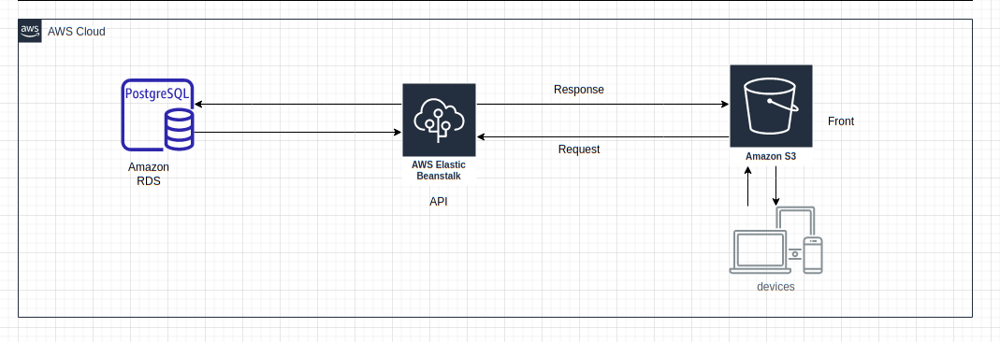

This is a full stack application that uses angular as front and express as back.

# Infrastructure

## Pipeline

### CircleCI

CircleCI was used for pipeline, here is the [config](https://github.com/MinaSameh1/deployment-process-project-starter/blob/master/.circleci/config.yml)  


## AWS



### DB

It is using AWS RDS postgres DB.  
The db is hosted currently using the free tier.

### ElasticBeanstalk

The [api](https://us-east-1.console.aws.amazon.com/elasticbeanstalk/home?region=us-east-1#/environment/dashboard?applicationName=udagram-api&environmentId=e-kb5rncecaf) is hosted on ElasticBeanstalk.

```bash
npm run api:deploy # To deploy on elasticbean, will build and deploy.
```

### S3 bucket

The website is hosted on S3 bucket

```bash
npm run frontend:deploy # To deploy on S3, runs ng build first.
```

### Application

Both front and backend use Typescript.

#### Front

The Front uses Angular version 8 and Ionic version 5, jasmine for unit testing, karma and protractor for e2e.

#### Backend

The backend uses expressjs version 4 and sequalize ORM for db.
